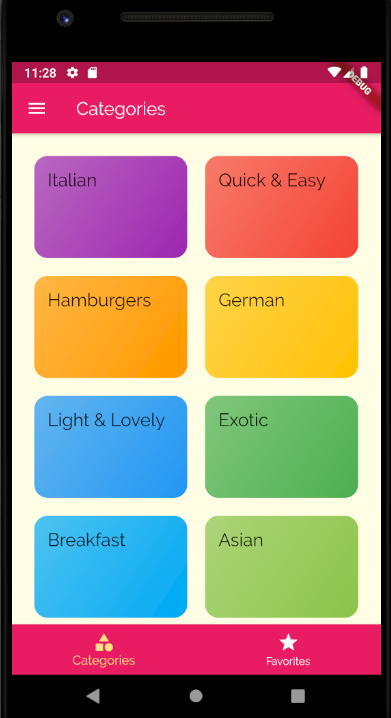
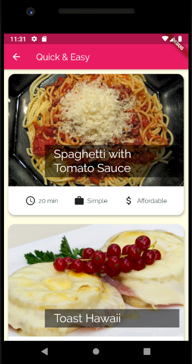

# MyMeals App

**App description**:
MyMeals app is used to locally store your personal recipes for a big variety of meals. The meals are divided into categories and they can be filtered (gluten-free, lactose-free, vegan etc.). Each meal has its own ingredients and steps to make it. There is also an option to mark your favorite meals separately.

**Developed with:** Flutter

**App screenshots:**

 
